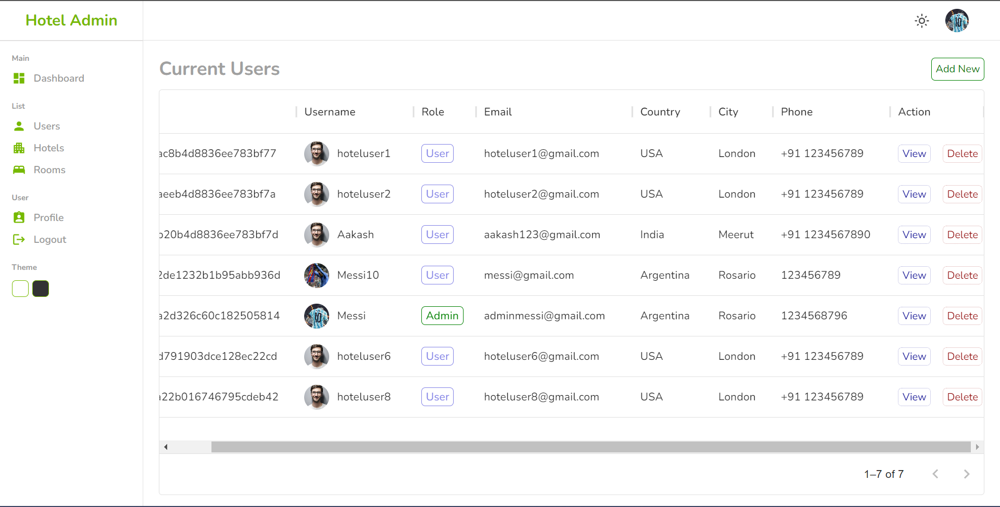
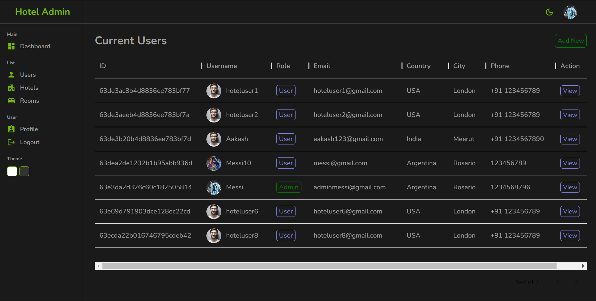

## This is a hotel booking app just like booking.com. it let you book hotel based on the availability and much more.

 

### Tech Stack: React.js, CSS, Node.js, Express.js, MongoDB, mongoose 

- A hotel booking app where users can **search** for destinations and book a hotel room based on availability and pay via the **Razorpay payment gateway**.

- The app provides a secure **authentication system using JSON Web Token**, log-in, and sign-up support and has an **admin dashboard** where the admin can create, read, update, and delete hotels, rooms, and users.

- The admin dashboard is developed using **react.js** and **material UI** and supports both light and dark modes.

 

***[Click here to see live](https://shivanand-hotel-booking.netlify.app)***

***[Project introduction video](!https://www.youtube.com/watch?v=ryjh2uTD1mg)***

 

### Home Page
.png)

 

### Admin DashBorad - Light Mode

 

### Admin DashBorad - Dark Mode

